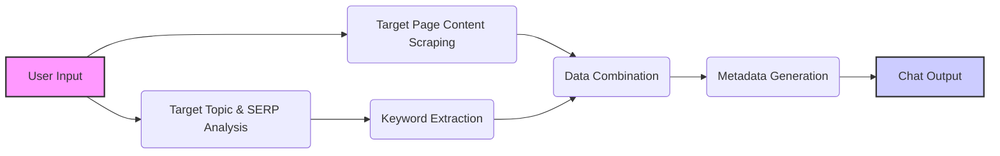

# Week 2 - Meta & Keyword Targeting Agent

_This tool is designed to quickly generate SEO-optimized titles, meta descriptions and keyword targets for a target page and topic. It leverages AI and various APIs to provide both keyword targets and optimized content._

- _You can find the video tutorial for this tool here: [Watch on YouTube](https://www.youtube.com/watch?v=dyCNbuzYf9Y)._
- _You can find a live demo of this tool here: [Test the workflow now](https://ai.seoworkflows.com/tool/meta-keyword-targeting-agent)._

## Overview

This tool is designed to help with meta and keyword targeting strategy. It leverages AI and various APIs to analyze web pages, generate keyword targets, and create SEO-optimized title tags and meta descriptions.

**Key Features:**

- Scrapes content from a target URL.
- Identifies relevant keywords using DataForSEO API.
- Retrieves SERP results for a target topic using Google SERPER API.
- Generates SEO-optimized title tags and meta descriptions.
- Provides reasoning behind the generated metadata.

## How It Works

This Langflow project is structured with multiple flows that work together to generate the final output:



1.  **User Input:** The process begins with a user providing a target URL and a target topic via the **Chat Input** node.

2.  **Target Page Content Scraping:** This flow focuses on extracting the main content from the target URL. It includes:

    - **Prompt (ScrapeMainContentPromp):** Formats a prompt to instruct the agent to scrape the content of the target URL using the Firecrawl API.
    - **Tool (FirecrawlScrapeApiTool):** Uses the Firecrawl API to scrape the content from the target URL.
    - **Agent (Main Content Scraper Agent):** Uses an LLM to scrape the content of the target URL and output it in markdown format.

3.  **Target Topic & SERP Analysis:** This flow focuses on analyzing the target topic and generating SERP results. It includes:

    - **Prompt (GetSERPPrompt):** Formats a prompt to instruct the agent to get SERP results for the target topic using the Google SERPER API.
    - **Tool (GoogleSerperAPITool):** Uses the Google SERPER API to get the SERP results for the target topic.
    - **Agent (Get SERP Agent):** Uses an LLM to get the SERP results for the target topic.

4.  **Keyword Extraction:** This flow focuses on extracting keywords from the SERP results using the DataForSEO API. It includes:

    - **Tool (PageKeywordsExtractorTool):** Uses the DataForSEO API to extract keywords for each URL in the SERP results.
    - **Prompt (KeywordExtractionPrompt):** Formats a prompt to instruct the agent to extract and organize keywords from URLs into a markdown table.
    - **Agent (Keyword Extraction Agent):** Uses an LLM to extract and organize keywords from URLs into a markdown table.

5.  **Data Combination:** This step combines the outputs from the previous flows into a single text chunk. It includes:

    - **Prompt Template:** Combines the user input, keyword targets, and scraped content into a single text chunk.

6.  **Metadata Generation:** This step analyzes the combined text to generate SEO-optimized title tags and meta descriptions. It includes:

    - **Prompt (CreateOptimizationTablePrompt):** Formats a prompt to instruct the LLM to create a markdown table with SEO-optimized metadata.
    - **ChatModel (OpenAI):** Uses an LLM to analyze the combined text and generate the metadata.

7.  **Output Display:** The final step displays the results in a user-friendly format. It includes:

    - **Chat Output:** Displays the results in a user-friendly markdown table format.

## Environment Variables

To use this tool, you need to set the following environment variables in your Langflow instance:

- **`FIRECRAWL_API_KEY`**: Your Firecrawl API key. You can obtain one from the Firecrawl website: [https://firecrawl.dev/](https://firecrawl.dev/)
- **`SERPER_API_KEY`**: Your Serper API key. You can obtain one from the Serper website: [https://serper.dev/](https://serper.dev/)
- **`DATAFORSEO_USERNAME`**: Your DataForSEO username. You can obtain one from the DataForSEO website: [https://dataforseo.com/](https://dataforseo.com/)
- **`DATAFORSEO_PASSWORD`**: Your DataForSEO password. You can obtain one from the DataForSEO website: [https://dataforseo.com/](https://dataforseo.com/)
- **`OPENAI_API_KEY`**: Your OpenAI API key. You can obtain one from the OpenAI website: [https://platform.openai.com/](https://platform.openai.com/)

**How to Set Environment Variables:**

1.  After uploading the flow to Langflow, click on the "Settings" icon (usually a gear icon) in the top right corner.
2.  Navigate to the "Environment Variables" section.
3.  Add the required variables with their corresponding values.

## Input Format

The tool expects the following input format. Make sure to include the `**Page Target**:` and `**Target Topic**:` headings:

- **Page Target**: The URL of the page for which you want to generate metadata. Only one source URL should be provided.
- **Target Topic**: The main topic of the page.

**Example Input:**

```
**Page Target**:  https://www.bankrate.com/investing/types-of-stock/
**Target Topic**:  types of stocks
```

## Output Format

The tool will output a markdown table with the following columns:

| Target Page  | Keyword Targets | Title Tag   | Description        | Reasoning   |
| ------------ | --------------- | ----------- | ------------------ | ----------- |
| [TARGET_URL] | [KEYWORD_LIST]  | [TITLE_TAG] | [META_DESCRIPTION] | [REASONING] |

- **Target Page:** The URL of the page for which metadata is generated.
- **Keyword Targets:** A list of the highest quality keyword targets for the target page, ordered by search volume.
- **Title Tag:** The SEO-optimized title tag for the target page.
- **Description:** The concise and engaging meta description for the target page.
- **Reasoning:** The rationale behind the choices for the Title Tag and Description.

## Stay Updated

Follow us to stay updated on the latest AI SEO tools released every Tuesday!

- **Blog:** [https://www.seoworkflows.com/blog](https://www.seoworkflows.com/blog)
- **YouTube:** [https://www.youtube.com/@seoworkflows](https://www.youtube.com/@seoworkflows)
- **LinkedIn:** [https://www.linkedin.com/company/seo-workflows/](https://www.linkedin.com/company/seo-workflows/)

Happy testing! 🚀

```

```
