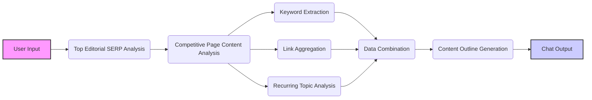

# Week 3 - Editorial Content Briefing AI Agent

_This tool is designed to help with content mapping and planning for SEO. It leverages AI to perform competitive analysis, aggregate keyword targets, and provide an optimized content outline based on a given topic._

- _You can find the video tutorial for this tool here: [Watch on YouTube](https://www.youtube.com/watch?v=BfJPf7DnkH8)._
- _You can find a live demo of this tool here: [Test the workflow now](https://ai.seoworkflows.com/tool/editorial-content-briefing-agent)._

## Overview

This tool is designed to assist with SEO content planning by analyzing top-ranking pages for a given topic. It leverages AI and various APIs to gather competitive data, extract keywords, and generate a comprehensive content outline.

**Key Features:**

- Uses Tavily AI Search to identify top-ranking pages for a given topic.
- Scrapes content from identified URLs using Firecrawl API.
- Extracts keywords from competitive pages using DataForSEO API.
- Identifies recurring topics and key points across competitive pages.
- Aggregates external links found on competitive pages.
- Generates a detailed, SEO-optimized content outline.

## How It Works

This Langflow project is structured with multiple flows that work together to generate the final output:



1.  **User Input:** The process begins with a user providing a topic via the **Chat Input** node.

2.  **Top Editorial SERP Analysis:** This flow focuses on identifying top-ranking pages with informational intent for the given topic. It includes:

    - **Prompt (GetEditorialSERP):** Formats a prompt to instruct the agent to use Tavily Search to investigate the top 3 results for the query and analyze the findings.
    - **Tool (TavilyAISearch):** Uses the Tavily AI Search API to get the top search results for the given topic.
    - **Agent (Get Top Editorial SERP Agent):** Uses an LLM to analyze the search results and identify URLs with informational intent.

3.  **Competitive Page Content Analysis:** This flow focuses on scraping and analyzing the content of the identified URLs. It includes:

    - **Prompt (GetCompetitivePageSummaries):** Formats a prompt to instruct the agent to scrape each page from the search results and organize the content into well-structured markdown summaries.
    - **Tool (FirecrawlScrapeApiTool):** Uses the Firecrawl API to scrape the content from the identified URLs.
    - **Agent (Competitive Page Content Analysis Agent):** Uses an LLM to scrape, organize, and summarize content from URLs, including headers, key points, subheadings, and links.

4.  **Keyword Extraction:** This flow focuses on extracting keywords from the identified URLs using the DataForSEO API. It includes:

    - **Tool (PageKeywordsExtractorTool):** Uses the DataForSEO API to extract keywords for each URL.
    - **Prompt (GetCompetitiveKeywords):** Formats a prompt to instruct the agent to extract and organize keywords from URLs into a markdown table.
    - **Agent (Competitive Keyword Extraction Agent):** Uses an LLM to extract and organize keywords from URLs into a markdown table.

5.  **Link Aggregation:** This flow focuses on aggregating all external links found on the competitive pages. It includes:

    - **Prompt (AggregatePageLinks):** Formats a prompt to instruct the LLM to consolidate the links from across the outputs.

6.  **Recurring Topic Analysis:** This flow focuses on identifying recurring topics across the competitive pages. It includes:

    - **Prompt (AggregateRecurringTopics):** Formats a prompt to instruct the LLM to analyze the content outlines to identify recurring topics.

7.  **Data Combination:** This step combines the outputs from the previous flows into a single text chunk. It includes:

    - **Prompt Template:** Combines the keyword targets, content outlines, links, and recurring topics into a single text chunk.

8.  **Content Outline Generation:** This step analyzes the combined text to generate a detailed, SEO-optimized content outline. It includes:

    - **Prompt (ContentOutlineGenerator):** Formats a prompt to instruct the LLM to create a comprehensive, SEO-optimized content outline.
    - **ChatModel (OpenAI):** Uses an LLM to analyze the combined text and generate the content outline.

9.  **Output Display:** The final step displays the results in a user-friendly format. It includes:

    - **Custom Component (CleanMarkdownComponent):** Uses textwrap to clean the final markdown output.
    - **Chat Output:** Displays the results in a user-friendly markdown format.

## Environment Variables

To use this tool, you need to set the following environment variables in your Langflow instance:

- **`TAVILY_API_KEY`**: Your Tavily API key. You can obtain one from the Tavily website: [https://tavily.com/](https://tavily.com/)
- **`FIRECRAWL_API_KEY`**: Your Firecrawl API key. You can obtain one from the Firecrawl website: [https://firecrawl.dev/](https://firecrawl.dev/)
- **`DATAFORSEO_USERNAME`**: Your DataForSEO username. You can obtain one from the DataForSEO website: [https://dataforseo.com/](https://dataforseo.com/)
- **`DATAFORSEO_PASSWORD`**: Your DataForSEO password. You can obtain one from the DataForSEO website: [https://dataforseo.com/](https://dataforseo.com/)
- **`OPENAI_API_KEY`**: Your OpenAI API key. You can obtain one from the OpenAI website: [https://platform.openai.com/](https://platform.openai.com/)

**How to Set Environment Variables:**

1.  After uploading the flow to Langflow, click on the "Settings" icon (usually a gear icon) in the top right corner.
2.  Navigate to the "Environment Variables" section.
3.  Add the required variables with their corresponding values.

## Input Format

The tool expects the following input format:

- **Topic**: The topic for which you want to generate a content outline.

**Example Input:**

```
how to prepare for a trip to iceland during the winter?
```

## Output Format

The tool will output a markdown format with the following structure:

```
## Content Outline:

**H2: [Main Section Header 1]** - **H3: [Sub-Section Header 1.1]** - **Content Outline**: [Content points for 1.1] - **H3: [Sub-Section Header 1.2]** - **Content Outline:** [Content points for 1.2] - **Media Ideas:** [Image, Video, Infographic, etc.]

**H2: [Main Section Header 2]** - **H3: [Sub-Section Header 2.1]** - **Content Outline**: [Content points for 2.1] - **H3: [Sub-Section Header 2.2]** - **Content Outline:** [Content points for 2.2] - **Media Ideas:** [Image, Video, Infographic, etc.]

(Continue until you have a robust outline for the new piece of content)
```

- **H2:** Main section headers, optimized for relevant keywords.
- **H3:** Sub-section headers that further break down the topic.
- **Content Outline:** Brief content points for each section and sub-section.
- **Media Ideas:** Suggestions for media that could enhance the content and user engagement.

## Stay Updated

Follow us to stay updated on the latest AI SEO tools released every Tuesday!

- **Blog:** [https://www.seoworkflows.com/blog](https://www.seoworkflows.com/blog)
- **YouTube:** [https://www.youtube.com/@seoworkflows](https://www.youtube.com/@seoworkflows)
- **LinkedIn:** [https://www.linkedin.com/company/seo-workflows/](https://www.linkedin.com/company/seo-workflows/)

Happy testing! 🚀
